# NetflixClone

`NetflixClone`, popüler dizi ve filmleri keşfetmek, izlemek ve arkadaşlarınızla paylaşmak için tasarlanmış bir mobil uygulamadır. Modern MVVM mimarisi ve protocol-oriented programlama yaklaşımı kullanılarak geliştirilmiş ve kullanıcı deneyimini zenginleştiren çeşitli özellikler içermektedir.

## Özellikler

- **MVVM Mimarisine ve Protocol-Oriented Programlamaya Uygun**: Temiz kod prensiplerine uygun şekilde MVVM mimarisi ile ve protocol-oriented programlama yaklaşımı kullanılarak geliştirilmiştir. Sayfalar arası haberleşme için delegasyon işlemleri kullanılmaktadır.
- **Generic Network Layer**: Veri alışverişini kolaylaştıran ve yeniden kullanılabilir bir network katmanı.
- **Dependency Injection**: Bağımlılıkların yönetimi için dependency injection yapısı kullanılmıştır.
- **Offline İzleme**: Realm kullanılarak gerçekleştirilen download işlemi ile dizi ve filmleri çevrimdışı izleyebilme.
- **Film Paylaşımı(Deep Link)**: Deep Link desteği ile arkadaşlarınızla dizi ve film paylaşabilirsiniz. Paylaşılan link üzerinden doğrudan ilgili içeriğin detay sayfasına erişilebilir.
- **Network Kontrolü**: Reachability paketi ile internet bağlantısının durumu sürekli olarak kontrol edilir. Ağ bağlantısı kesildiğinde kullanıcıya bildirim gösterilir. Hücresel veri üzerinden film oynatılmak istendiğinde kullanıcıya uyarı verilir.
- **Responsive Tasarım**: Farklı ekran boyutları ve oranlarına uyum sağlayabilen responsive bir tasarıma sahiptir, böylece kullanıcılar her cihazda en iyi izleme deneyimine erişebilir.
- **Bildirimler**: `NotificationCenter.default` kullanarak, film indirme işlemi tamamlandığında kullanıcıya otomatik bildirimler gönderilir.

## Kullanılan Paketler

- **Realm**: Veri saklama ve yönetimi.
- **SDWebImage**: Resimleri asenkron bir şekilde indirme ve önbelleğe alma.
- **Reachability.swift**: Ağ bağlantı durumunu kontrol etme.
- **SnapKit**: Kod ile kullanıcı arayüzü düzenini kolaylaştıran bir Auto Layout kütüphanesi.

https://github.com/tahaturan/NetflixClone-MVVM/assets/94213149/f087d1b4-53b2-43ff-b9ad-39fb40b8e67d

# Uygulama Görüntüleri

| Home | Home | Home |
|-------------------|-------------------|-------------------|
| 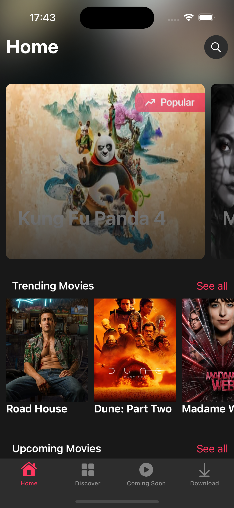 | 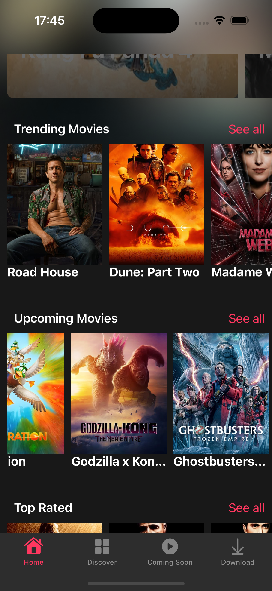 | 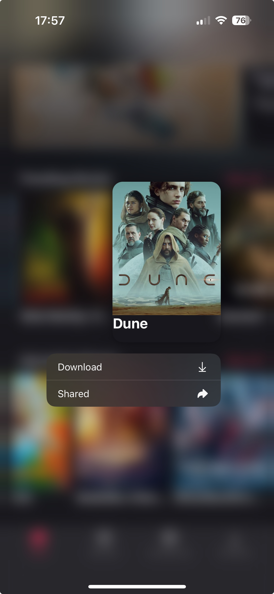 |

| Search | Search | Search |
|-------------------|-------------------|-------------------|
| 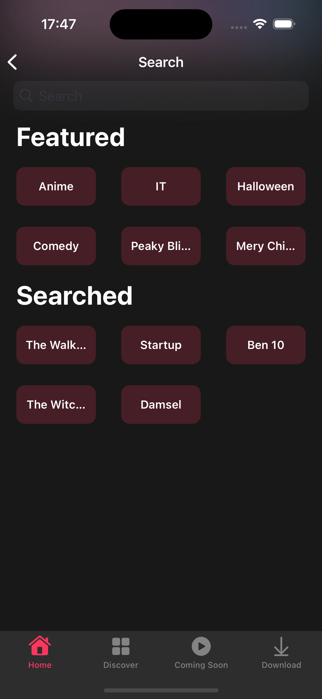 | 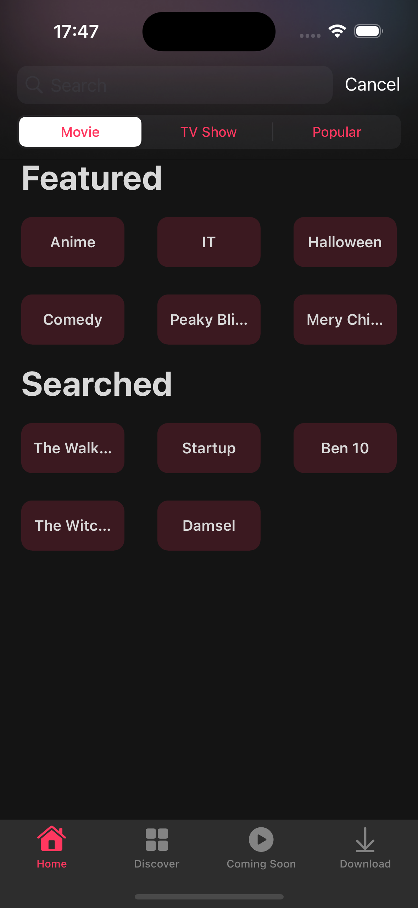 | 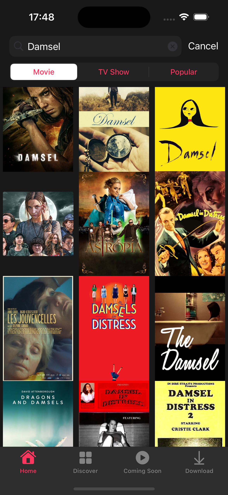 |

| Detail | Discover| Coming Soon |
|-------------------|-------------------|-------------------|
| 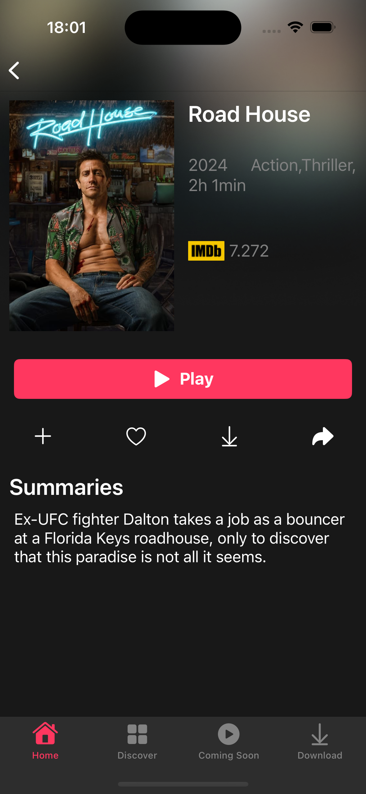 | 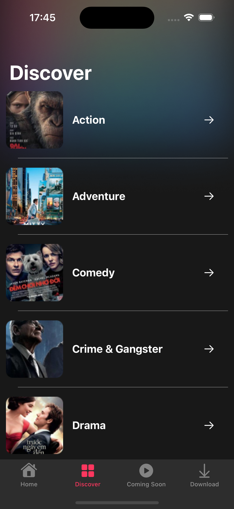 | 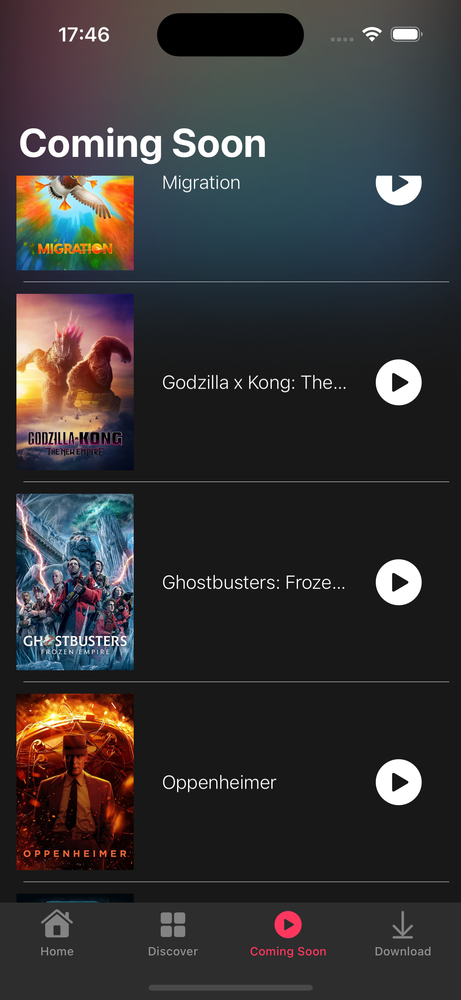 |

| Download | Shared | Home |
|-------------------|-------------------|-------------------|
| 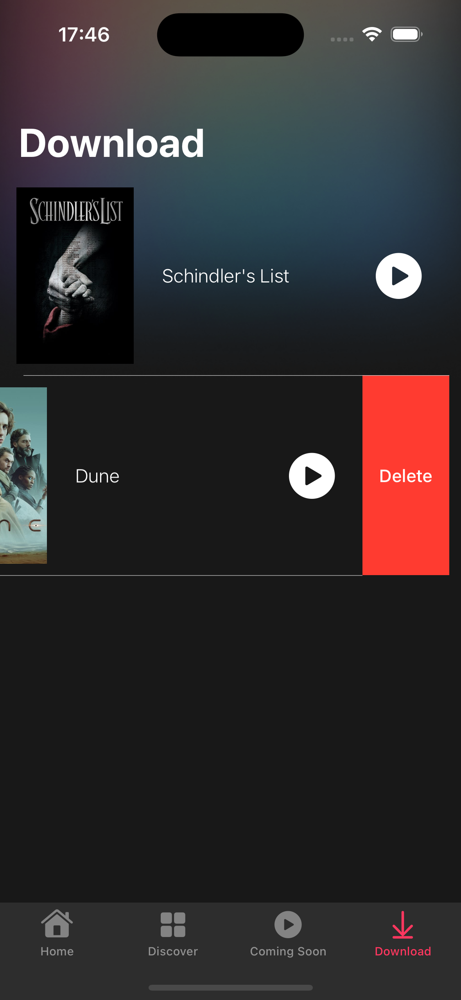 |  | 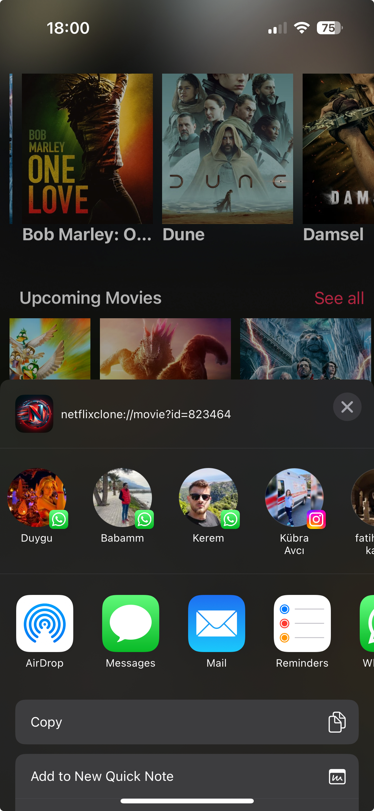 |

| No connection | No connection | Cellular |
|-------------------|-------------------|-------------------|
| 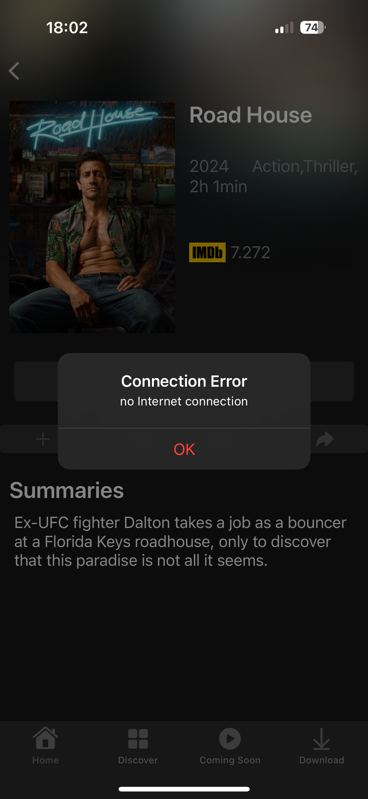 | 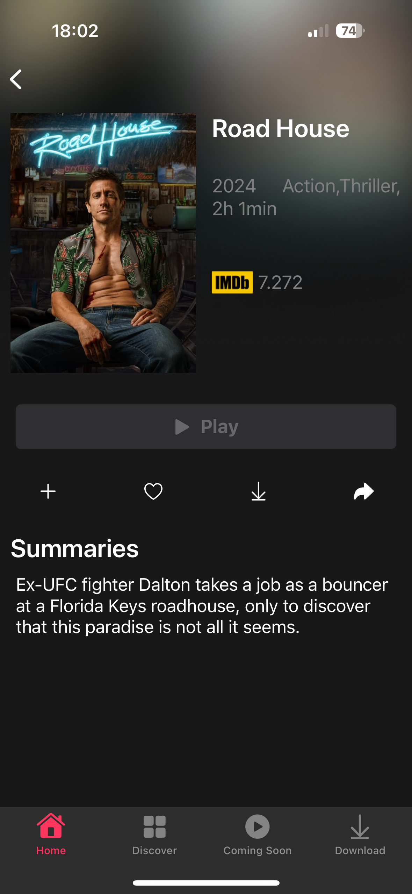 | 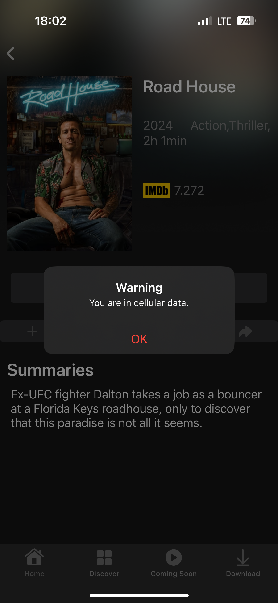 |

